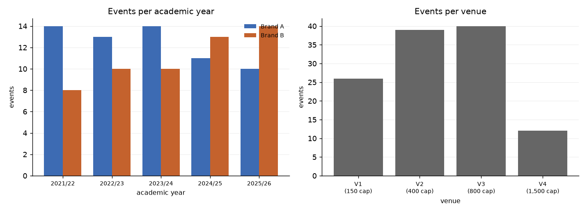
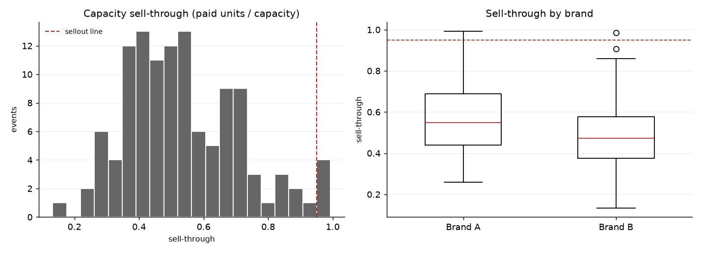
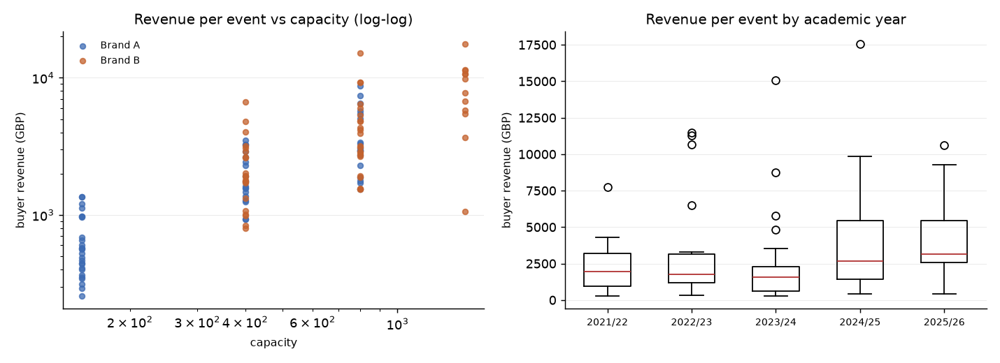
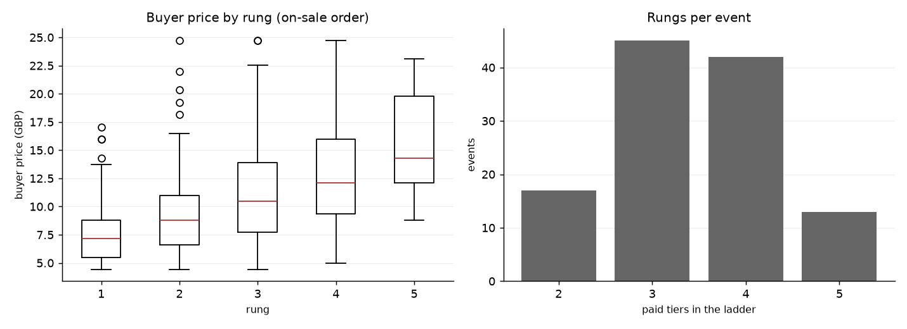
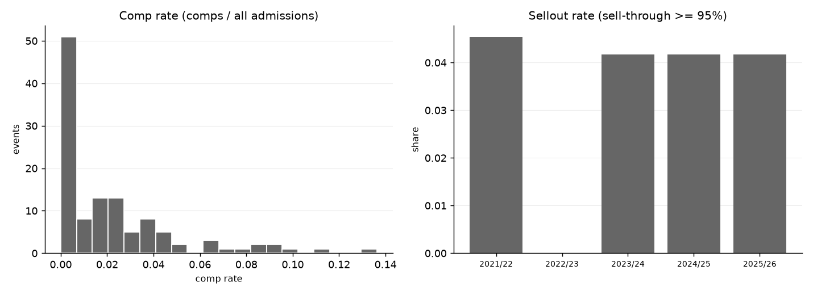

# Phase 1 — Descriptives

**SYNTHETIC DATA — nothing here is real (Brand A/B, venues V1-V4, FAKE ids).**

Source: `synthetic`, seed `20260811`
Regenerate: `uv run python -m pricing.phase1 --synthetic --seed 20260811`

Counts, distributions and shapes only. **No model is fitted here and no hypothesis is
tested**: there is no p-value in this report, no multiple-comparison correction, no
significance claim and no out-of-sample confirmation. `preregistration.md` has been
FROZEN since commit `1c7196d` (SPEC.md §5.3), so the §5.4 list is now fixed and the
ordering it protects has been honoured — but nothing on that list has been tested,
because there is no real data to test it on. The platform exports are parked, and
every number below comes from the seeded synthetic fixture. Testing a pattern you
noticed while making this report is SPEC.md §5.2, the cardinal sin; freezing the list
first is what makes that a checkable rule rather than a good intention.

**What that does not mean.** Descriptive cross-tabs by academic year, brand and venue
are below, and each of those is also a line on the §5.4 list. They are here because
SPEC.md §8.9 says you must know the growth trend and the programme's composition before
you can believe any later calendar effect — a night you only started running recently
proxies for 'recent', and a brand that moved into bigger rooms shows falling
sell-through while growing. Reading a median off a table is not testing a hypothesis;
what would be is comparing it to a null and claiming the difference is real, and
nothing here does that.

**What is genuinely absent is the calendar crossed with an outcome:** no tickets by term
week, no freshers' week, no exam period, no loan instalment, no tickets by day of week.
Day of week and academic year appear below only as counts of *events*.

---

## 1. The programme

- **117 events that ran**, 2021-09-23 to 2026-06-20
- **3 cancelled/pulled events**, kept in the dataset and flagged (SPEC.md §8.4), excluded from every table below
- **32,999 paid tickets**, 579 comps/guestlist (excluded from demand, SPEC.md §8.7)
- **402 paid tiers** across those events
- Platforms: fixr 98, youni 10, tbc 9

| academic_year | Brand A | Brand B | total |
|---|---|---|---|
| 2021/22 | 14 | 8 | 22 |
| 2022/23 | 13 | 10 | 23 |
| 2023/24 | 14 | 10 | 24 |
| 2024/25 | 11 | 13 | 24 |
| 2025/26 | 10 | 14 | 24 |

### Per venue

| venue | city | events | capacity | brands | median_tickets |
|---|---|---|---|---|---|
| V1 | City A | 26 | 150 | Brand A | 100.00 |
| V2 | City A | 39 | 400 | Brand A, Brand B | 214.00 |
| V3 | City B | 40 | 800 | Brand A, Brand B | 331.50 |
| V4 | City B | 12 | 1,500 | Brand B | 599.50 |

### Per day of week

Counts of **events**, not of tickets. This is programme composition — which nights
the brands actually ran — and it is here because SPEC.md §8.9 warns that a night
you only started running recently will proxy for 'recent' in any later model. The
tickets-by-day-of-week comparison is a §5.4 hypothesis and is not tested here.

| dow | events |
|---|---|
| Friday | 34 |
| Saturday | 32 |
| Thursday | 26 |
| Wednesday | 25 |

---

## 2. Capacity utilisation

| measure | n | min | p10 | p25 | median | p75 | p90 | max | mean |
|---|---|---|---|---|---|---|---|---|---|
| sell_through (paid / capacity) | 117 | 0.133 | 0.342 | 0.403 | 0.511 | 0.660 | 0.760 | 0.993 | 0.535 |
| room_fill (paid + comps / capacity) | 117 | 0.133 | 0.346 | 0.419 | 0.520 | 0.667 | 0.784 | 1.087 | 0.547 |
| tickets sold | 117 | 57.000 | 97.000 | 161.000 | 248.000 | 344.000 | 515.000 | 1,001.000 | 282.043 |

**Sellout rate: 3.4%** (4 of 117 events at or above 95% sell-through).

| academic_year | events | median_capacity | median_tickets | median_sell_through | sellouts | sellout_rate |
|---|---|---|---|---|---|---|
| 2021/22 | 22 | 600.000 | 252.500 | 0.445 | 1 | 0.045 |
| 2022/23 | 23 | 800.000 | 218.000 | 0.450 | 0 | 0.000 |
| 2023/24 | 24 | 400.000 | 197.500 | 0.530 | 1 | 0.042 |
| 2024/25 | 24 | 600.000 | 284.000 | 0.516 | 1 | 0.042 |
| 2025/26 | 24 | 400.000 | 297.000 | 0.638 | 1 | 0.042 |

---

## 3. Revenue per event

`revenue_buyer` is what buyers paid (face + fee); `revenue_face` is face value only.
**Both are provisional**: `fee_treatment` is `UNKNOWN` for every platform
(SPEC.md §8.6), so face-plus-fee is the assumed reading and not a confirmed one.

| measure | n | min | p10 | p25 | median | p75 | p90 | max | mean |
|---|---|---|---|---|---|---|---|---|---|
| revenue_buyer (GBP) | 117 | 255.20 | 510.62 | 1,067.55 | 1,927.75 | 3,938.00 | 6,988.96 | 17,532.35 | 3,180.17 |
| revenue_face (GBP) | 117 | 232.00 | 464.20 | 970.50 | 1,752.50 | 3,580.00 | 6,353.60 | 15,938.50 | 2,891.06 |
| revenue per paid ticket (GBP) | 117 | 4.40 | 5.14 | 6.65 | 8.96 | 10.97 | 14.83 | 20.73 | 9.39 |
| fixed cost stack (GBP) | 117 | 1,471.07 | 1,957.90 | 3,048.59 | 5,064.28 | 7,016.61 | 10,362.10 | 16,272.66 | 5,513.14 |

### By brand

| brand | events | median_capacity | median_tickets | median_sell_through | sellout_rate | median_revenue | median_comp_rate |
|---|---|---|---|---|---|---|---|
| Brand A | 62 | 400.000 | 194.500 | 0.548 | 0.048 | 1,418.450 | 0.003 |
| Brand B | 55 | 800.000 | 314.000 | 0.472 | 0.018 | 3,115.200 | 0.015 |

---

## 4. Tier-ladder shapes

`rung` is position in **on-sale order** (from each tier's first sale), not the tier
name's ordinal — names disagree across events and some state no position at all.

| rung | tiers | events | median_price | median_lead_days | units | share_of_units |
|---|---|---|---|---|---|---|
| 1 | 117 | 117 | 7.150 | 69.000 | 13,208 | 0.400 |
| 2 | 117 | 117 | 8.800 | 28.000 | 10,128 | 0.307 |
| 3 | 100 | 100 | 10.450 | 11.000 | 6,475 | 0.196 |
| 4 | 55 | 55 | 12.100 | 0.000 | 2,732 | 0.083 |
| 5 | 13 | 13 | 14.300 | 0.000 | 456 | 0.014 |

### Ladder span per event

| measure | n | min | p10 | p25 | median | p75 | p90 | max | mean |
|---|---|---|---|---|---|---|---|---|---|
| rungs per event | 117 | 2.00 | 2.00 | 3.00 | 3.00 | 4.00 | 5.00 | 5.00 | 3.44 |
| top price / opening price | 117 | 1.00 | 1.27 | 1.37 | 1.60 | 1.87 | 2.12 | 2.93 | 1.65 |
| first on-sale (days out) | 117 | 45.00 | 49.00 | 57.00 | 69.00 | 84.00 | 90.00 | 94.00 | 69.91 |
| ladder span (days) | 117 | 36.00 | 47.00 | 54.00 | 66.00 | 83.00 | 90.00 | 94.00 | 67.60 |

The last row is the one Phase 4 lives or dies on. If every event opened its ladder
on the same schedule, tier price and lead time would be the same variable and the
elasticity would not be identified (SPEC.md §4.3). Spread in `first on-sale` and
`ladder span` across events is the variation that separates them.

---

## 5. Comps and guestlist

| brand | events | events_with_comps | comps_total | median_comp_rate | max_comp_rate |
|---|---|---|---|---|---|
| Brand A | 62 | 31 | 262 | 0.038 | 0.136 |
| Brand B | 55 | 36 | 317 | 0.023 | 0.091 |

---

## 6. Cancelled events (SPEC.md §8.4)

| event_id | event_date | brand | venue | capacity | tickets | sell_through |
|---|---|---|---|---|---|---|
| FAKE-EV-006 | 2021-11-18 | Brand B | V2 | 400 | 37 | 0.092 |
| FAKE-EV-016 | 2022-03-12 | Brand B | V4 | 1,500 | 84 | 0.056 |
| FAKE-EV-046 | 2023-06-02 | Brand B | V4 | 1,500 | 99 | 0.066 |

These are the nights that did not happen. They are in the table above and excluded
from every other table in this report, which is a choice, not an accident: their
sales histories are truncated at the moment they were pulled, so their sell-through
is not comparable to an event that ran. Excluding them means every model below is
**conditioned on the event having gone ahead**, and that limitation belongs in the
README (DECISIONS.md, survivorship).

---

## Figures

- `phase1_programme.png`
- `phase1_sell_through.png`
- `phase1_revenue.png`
- `phase1_ladder.png`
- `phase1_comps_sellouts.png`

