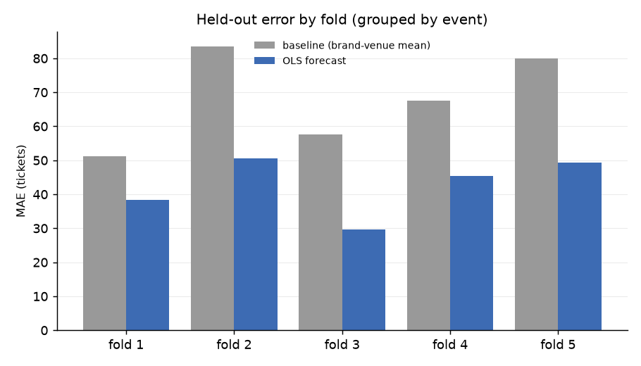
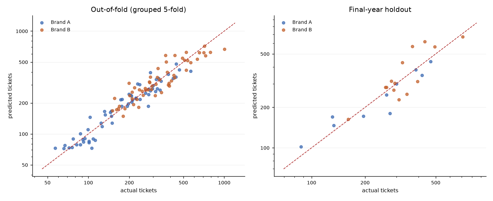
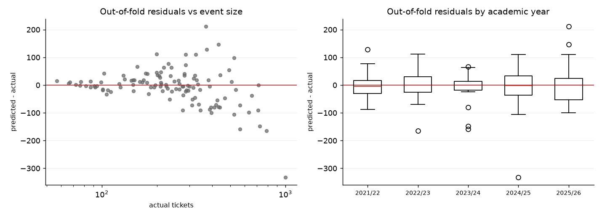

# Phase 2 — Demand forecast

**SYNTHETIC DATA — nothing here is real (Brand A/B, venues V1-V4, FAKE ids).**

Source: `synthetic`, seed `20260811`
Regenerate: `uv run python -m pricing.phase2 --synthetic --seed 20260811`

Predict **final paid tickets** from what was known at pricing time. Plain OLS on
`log(tickets)`, scored on held-out events against a naive brand-venue mean.

## Headline

- Grouped 5-fold CV, pooled: **MAE 42.7 tickets** (14.5% MAPE) vs baseline 68.0 (25.8%) — **37% better**
- Final-year holdout: **MAE 53.0 tickets** (16.6% MAPE) vs baseline 80.1 (25.2%) — **34% better**
- Sample: 117 events that ran, 2021/22 to 2025/26, median 248 tickets

The holdout is the honest number. It is a genuine forecast of a year the model
never saw, and it has to extrapolate the brand-growth trend one year past its data.

---

## 1. Look-ahead check (SPEC.md §8.2)

`assert_no_lookahead`: PASS — 9 features, none of them an outcome column, and all 117 rows reproduce identically from transactions truncated at each event's first sale.

The second half of that check is the one worth understanding. Feature names can be
made to look innocent; behaviour cannot. So the whole feature frame is rebuilt from
transactions truncated at each event's first sale, and required to come out
identical. Any feature that quietly reads later sales moves when the later sales are
taken away.

## 2. Features

| feature | what it is | known at pricing time |
|---|---|---|
| log_capacity | log licensed capacity | the room is booked before the on-sale |
| log_guarantee | log artist guarantee — the artist billing-tier proxy | the contract is signed before the on-sale; the fee IS the billing tier, priced by an agent who knows the draw |
| log_marketing | log(1 + marketing spend) | budgeted at planning. CAVEAT: the figure in the workbook is REALISED spend, and realised spend reacts to weak presale. Swap in the budgeted figure when the workbook carries it |
| lead_to_announce_days | days from first on-sale to the event | it is the schedule — the operator picks it |
| brand | Brand A / Brand B | known |
| venue | venue | booked |
| city | city | booked with the venue. Enters through the venue dummies rather than a term of its own — every venue sits in one city, so separate city dummies would be redundant |
| dow | day of week of the event | known |
| year_index | academic year 0..4, plus its interaction with brand | the brand-maturity trend (SPEC.md 8.9). Controls for growth so that nothing correlated with time gets to masquerade as a pattern |

**Not included: every academic-calendar feature on the SPEC.md §5.4 list.**
`preregistration.md` is still DRAFT, and §5.3 forbids testing those patterns before
it is frozen. The calendar is a big real driver of student-event demand, so the
errors below are an **upper bound** — the model is deliberately fighting with one
hand behind its back. Re-run after the freeze and the gap should close.

`marketing_spend` deserves its own warning. It predicts well precisely because it is
endogenous: more is spent on events already believed in. Useful for forecasting,
worthless as a causal statement, and **not** a valid instrument for price
(SPEC.md §4.5) for exactly that reason.

## 3. Held-out error

| split | n_train | n_test | model_MAE | model_MAPE_pct | baseline_MAE | baseline_MAPE_pct | MAE_improvement_pct |
|---|---|---|---|---|---|---|---|
| fold 1 | 93 | 24 | 38.4 | 14.7 | 51.2 | 22.1 | 25.0 |
| fold 2 | 93 | 24 | 50.5 | 15.8 | 83.6 | 29.3 | 39.6 |
| fold 3 | 94 | 23 | 29.6 | 12.4 | 57.7 | 26.5 | 48.7 |
| fold 4 | 94 | 23 | 45.5 | 16.0 | 67.6 | 26.2 | 32.8 |
| fold 5 | 94 | 23 | 49.3 | 13.5 | 80.0 | 24.8 | 38.4 |
| all folds pooled | 93 | 117 | 42.7 | 14.5 | 68.0 | 25.8 | 37.2 |
| final-year holdout | 93 | 24 | 53.0 | 16.6 | 80.1 | 25.2 | 33.8 |

Duan smearing factor on the holdout fit: **1.0106**. Applying it moves holdout MAE from 53.0 to 53.2 tickets.

`exp()` of a log-scale fit predicts the
median, not the mean; MAE and MAPE are minimised by the median, so the headline
numbers leave it off deliberately. It matters for Phase 5, where the *mean* profit
is the quantity of interest.

## 4. Coefficients (fitted on all events)

R-squared 0.936, adjusted 0.929, 13 parameters on 117 events.

| term | coef | std_err | ci_low | ci_high |
|---|---|---|---|---|
| Intercept | -0.208 | 0.066 | -0.339 | -0.077 |
| C(dow)[T.Saturday] | 0.002 | 0.042 | -0.081 | 0.085 |
| C(dow)[T.Thursday] | -0.004 | 0.046 | -0.094 | 0.086 |
| C(dow)[T.Wednesday] | -0.192 | 0.044 | -0.280 | -0.104 |
| C(brand)[T.Brand B] | 0.007 | 0.062 | -0.116 | 0.129 |
| C(venue)[T.V2] | 0.239 | 0.053 | 0.134 | 0.343 |
| C(venue)[T.V3] | 0.212 | 0.058 | 0.097 | 0.327 |
| C(venue)[T.V4] | 0.302 | 0.077 | 0.149 | 0.455 |
| log_capacity | 0.242 | 0.068 | 0.108 | 0.376 |
| log_guarantee | 0.167 | 0.020 | 0.127 | 0.208 |
| log_marketing | 0.410 | 0.071 | 0.269 | 0.551 |
| lead_to_announce_days | 0.001 | 0.001 | -0.002 | 0.003 |
| year_index | 0.056 | 0.016 | 0.025 | 0.087 |
| year_index:C(brand)[T.Brand B] | 0.004 | 0.022 | -0.041 | 0.048 |

On a log target a coefficient is approximately a proportional effect: a coefficient
of 0.25 on `log_capacity` means a 10% bigger room sells about 2.5% more. These are
**predictive associations, not causal effects** — capacity, guarantee and marketing
spend are all chosen by the same person, at the same time, using the same beliefs
about how the night will go (SPEC.md §4.1). Read them as 'what an event like this
usually does', never as 'what would happen if I changed this'.

## 5. What this cannot do

- **117 events is small** (SPEC.md §8.5). 13 parameters on that sample is already at the limit
  of what the data supports; this is exactly why there is no gradient booster here.
- **Cancelled events are excluded**, so every number is conditioned on the event
  having gone ahead (SPEC.md §8.4).
- **Events are not independent** (SPEC.md §8.10): two nights a week apart eat each
  other's audience. The cannibalisation features (`days_since_last_event`,
  `events_in_trailing_14d`) are on the pre-registered list and are not in this model
  yet. Standard errors above assume an independence the programme does not have.
- **The year trend extrapolates.** The holdout fit sees years 0-3 and predicts year
  4 with a straight line. That is the right test, and it is also the model's most
  fragile assumption.

---

## Figures

- `phase2_fold_error.png`
- `phase2_predicted_vs_actual.png`
- `phase2_residuals.png`

