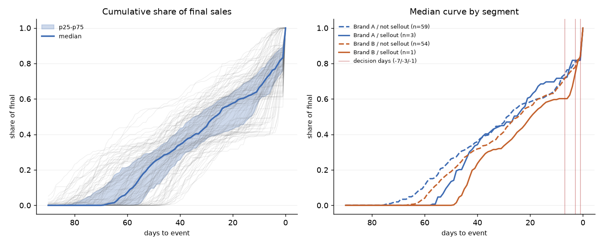
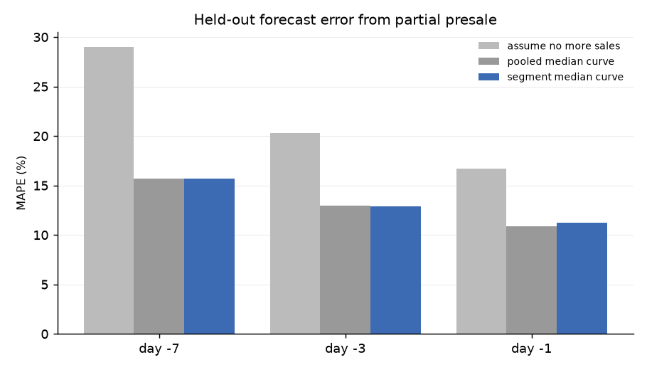
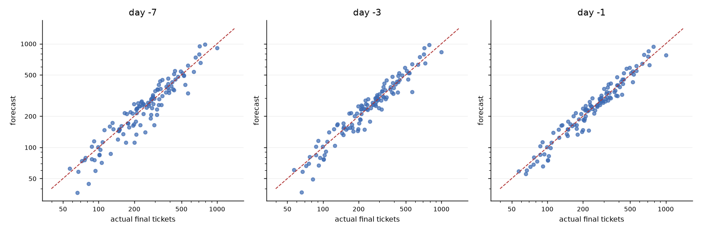

# Phase 3 — Sales curve

**SYNTHETIC DATA — nothing here is real (Brand A/B, venues V1-V4, FAKE ids).**

Source: `synthetic`, seed `20260811`
Regenerate: `uv run python -m pricing.phase3 --synthetic --seed 20260811`

How tickets accumulate against days-to-event, and what a partial presale forecasts.
Empirical median curves — no Bass diffusion, no fitted parameters, nothing to tune.

## Headline

- Median event has sold **72% of its final total with a week to go**, 83% with one day to go.
- Forecasting from the day -7 presale: **MAE 42.7 tickets, MAPE 15.7%** on held-out events.
- By day -1 that tightens to MAE 31.5 tickets, MAPE 11.2%.

### Is watching the presale worth anything?

Same events, same grouped-by-event discipline, so the rows are comparable:

| forecast | information used | MAE | MAPE_pct |
|---|---|---|---|
| Phase 2 model (pricing time) | features only, no tickets sold yet | 42.7 | 14.5 |
| sales curve at day -7 | presale to day -7 (72% of final sold) | 42.7 | 15.7 |
| sales curve at day -3 | presale to day -3 (79% of final sold) | 35.0 | 12.9 |
| sales curve at day -1 | presale to day -1 (83% of final sold) | 31.5 | 11.2 |

The presale forecast overtakes the pricing-time model at **day -3** (12.9% vs 14.5% MAPE) and not before. Earlier than that, what you already knew when you priced the event beats what the presale has told you so far. The obvious next step is to use both — the pricing-time forecast as the prior, the presale as the update — which is Phase 5's job, not this one's.

---

## 1. Curve shape

Measured over 117 events that ran, 90 days out to the door. Comps excluded (SPEC.md §8.7); cancelled events excluded, because a pulled event's final total is not a final total (SPEC.md §8.4).

| days_to_event | p10 | median | p90 | p90_minus_p10 |
|---|---|---|---|---|
| -60 | 0.000 | 0.072 | 0.314 | 0.314 |
| -30 | 0.314 | 0.444 | 0.608 | 0.294 |
| -21 | 0.394 | 0.568 | 0.715 | 0.321 |
| -14 | 0.426 | 0.618 | 0.758 | 0.332 |
| -7 | 0.497 | 0.722 | 0.890 | 0.394 |
| -3 | 0.637 | 0.794 | 0.982 | 0.346 |
| -1 | 0.685 | 0.832 | 1.000 | 0.315 |

`p90_minus_p10` is the assumption of this phase, measured. The method says an
event's presale is shaped like the median of its segment; that column says how far
from the median the middle 80% of events actually sit, and it is wide — the shape
assumption is doing real work and is only roughly true.

Note it does **not** shrink steadily as the event approaches. What improves is how
much of the answer is already banked: with a week to go the median event has sold
72% of its final total and by day -1 83%, so the forecast is scaling up a smaller and
smaller remainder. The accuracy comes from the numerator, not from the curve.

## 2. Segments

| segment | events | share_at_-14 | share_at_-7 | share_at_-3 | share_at_-1 |
|---|---|---|---|---|---|
| Brand A / not sellout | 59 | 0.615 | 0.737 | 0.808 | 0.831 |
| Brand A / sellout | 3 | 0.696 | 0.716 | 0.818 | 0.818 |
| Brand B / not sellout | 54 | 0.620 | 0.715 | 0.777 | 0.833 |
| Brand B / sellout | 1 | 0.581 | 0.602 | 0.739 | 0.840 |

**The `sellout` split is descriptive only and must never be used to forecast.** On
day -7 nobody knows which column an event belongs in — that is the answer, not an
input. It is shown because whether a sold-out night's curve is shaped differently is
worth knowing, and because writing down why it cannot be used is the whole lesson.

Segments below 12 events fall back to the pooled curve: Brand A / sellout (n=3), Brand B / sellout (n=1).

The forecaster below segments on **brand only**, which is known months in advance.

## 3. Held-out forecast error

Grouped 5-fold by event (SPEC.md §8.1): each fold's median curve is built from the
other four folds, so no event is forecast by a curve it helped draw.

| day | events | median_share_sold | segment_MAE | segment_MAPE_pct | pooled_MAE | pooled_MAPE_pct | nosale_MAE | nosale_MAPE_pct |
|---|---|---|---|---|---|---|---|---|
| -7 | 117 | 0.72 | 42.68 | 15.66 | 42.86 | 15.66 | 80.34 | 29.03 |
| -3 | 117 | 0.79 | 35.02 | 12.90 | 35.64 | 12.94 | 55.70 | 20.27 |
| -1 | 117 | 0.83 | 31.46 | 11.20 | 30.89 | 10.84 | 45.56 | 16.73 |

- `segment` — brand median curve, the forecaster.
- `pooled` — one curve for the whole programme. Read the gap honestly: if it is
  small, brand segmentation is buying nothing and should be dropped.
- `nosale` — assume not one more ticket sells. The floor any curve must clear.

Averaged over the three decision days the brand-segmented curve scores +0.11 MAPE points against the pooled one — that is, nothing. The two brands' presales are the same shape here, so the honest conclusion is to use the pooled curve. A split that buys nothing still costs degrees of freedom, and on real data it would eventually pick up noise and call it a segment.

## 4. What can go wrong

- **A tier drop after the forecast day breaks the shape.** The curve is a median
  over events whose ladders opened on their own schedules; an event that releases a
  new tier at day -5 gets a jump the median does not have. Ladder timing is in
  `event_tier.lead_time_open_days` and conditioning the curve on it is the obvious
  next refinement.
- **Sellouts truncate.** A night that sells out at day -4 has a curve that flattens
  because there is nothing left to sell, not because demand stopped. Scaling those
  curves up estimates *sales*, never *demand* — the difference matters the moment
  Phase 6 asks what a higher price would have earned.
- **Small segments.** With 5 folds and 2 brands the thinnest training segment here
  is around 46 events; the pooled fallback exists for real
  data, where a brand-venue-year segmentation would be very thin indeed.
- **The comparison with Phase 2 is not apples to apples.** Phase 2 forecasts before
  a single ticket is sold; this forecasts with most of them already sold. The right
  reading is 'how much does watching the presale add', not 'which model is better'.

---

## Figures

- `phase3_curves.png`
- `phase3_forecast_error.png`
- `phase3_forecast_scatter.png`

